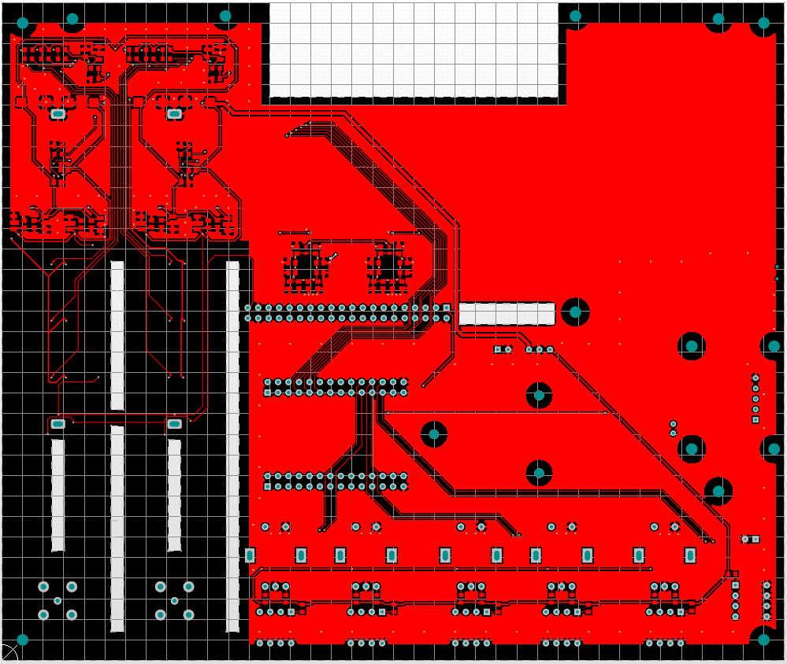
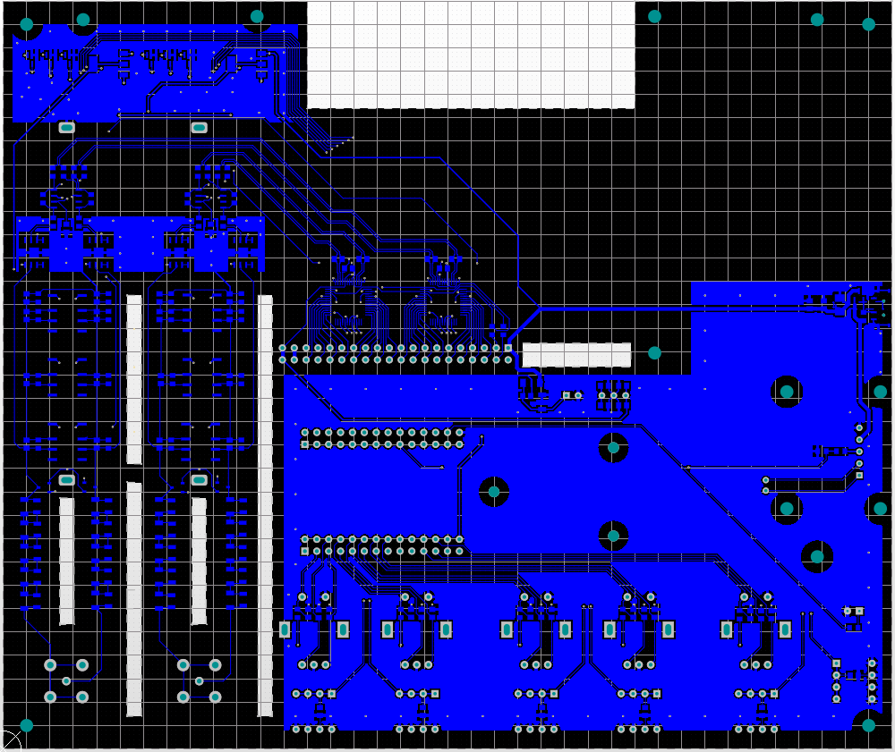
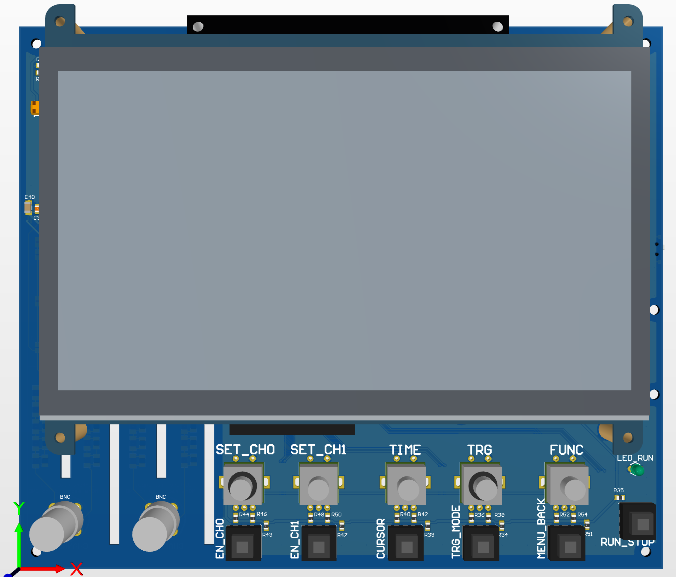
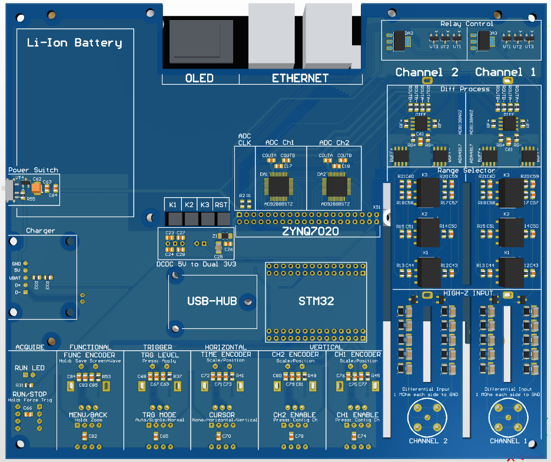
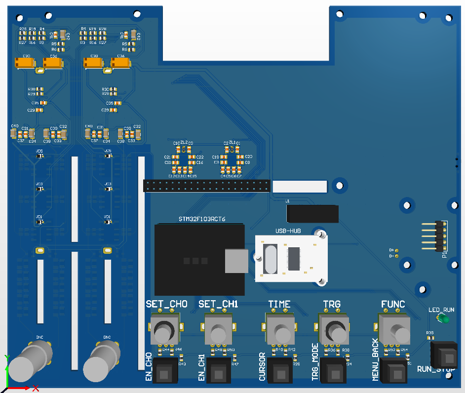

# OscilPCB — плата двухканального осциллографа

Проект основной платы самодельного осциллографа в Altium Designer. На плате размещены два измерительных канала с BNC-входами, аналоговой обработкой и АЦП AD9288, разъёмы для модуля Zynq-7020 и платы STM32, органы управления и крепления семидюймового LCD. Плата двухслойная, размер контура — 190 × 160 мм.

## Плата

*Разводка верхней стороны: фильтрующие конденсаторы и подтягивающие резисторы.*

*Разводка нижней стороны: входные тракты каналов, АЦП, питание и соединения с Zynq, STM и интерфейсом.*

## 3D-модель

*Верхняя сторона.*

*Нижняя сторона.*

*Верхняя сторона без LCD и Zynq.*

## Файлы проекта

- `AnalExtend/AnalExtend.PrjPcb` — проект Altium Designer; в этой же папке находятся PCB и схемы.
- `Lib/` — библиотеки символов, посадочных мест и 3D-моделей. Подробности для разработчика приведены в [Lib/DEVELOPMENT.md](Lib/DEVELOPMENT.md).
- `Manufacture/` — Gerber-файлы и файлы сверловки.

Откройте `AnalExtend/AnalExtend.PrjPcb` в Altium Designer 19, чтобы просмотреть или изменить схемы и плату. Изображения верхней и нижней сторон выше получены из файлов `Manufacture/`, а 3D-виды — из геометрии и встроенных моделей `AnalExtend.PcbDoc` с поверхностью платы из `Manufacture/`.
